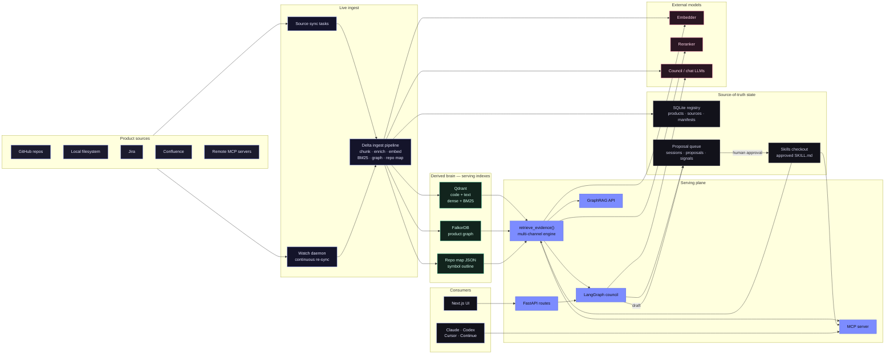
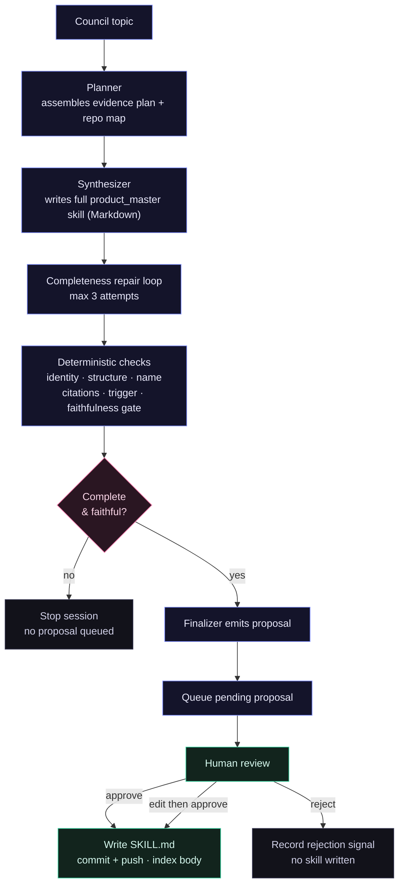

<p align="center">
  
</p>

<h1 align="center">Anvay</h1>

<p align="center">
  <strong>A living brain for your product — not just your code.</strong>
</p>

<p align="center">
  Anvay fuses your repos, tickets, docs, and hard-won tribal knowledge into one
  continuously-synced, cited intelligence layer — then serves it to every AI
  coding agent you use, over MCP.
</p>

<p align="center">
  <a href="./LICENSE"></a>
  
  
  
  
  
</p>

<p align="center">
  <a href="#quick-start">Quick Start</a>
  ·
  <a href="#mcp-usage">MCP Usage</a>
  ·
  <a href="#system-architecture">Architecture</a>
  ·
  <a href="./CONTRIBUTING.md">Contributing</a>
  ·
  <a href="./ENGINEERING.md">Engineering Spec</a>
</p>

---

## The context problem is a knowledge problem

Every product carries a brain that lives nowhere. It's split across the codebase,
the Jira board, the Confluence space, the README nobody updated, and the three
senior engineers who answer the same questions in Slack every week. New
contributors can't find the starting line. Maintainers re-explain the same
architecture. Docs drift out of sync with the code they describe. And your AI
coding agents — the ones you now trust to write real changes — dive into
unfamiliar code with **none** of that context. They don't know your conventions,
your blast radius, or why that "obvious" refactor will page someone at 3am.

Anvay exists to end that. It takes everything your product knows — scattered
across systems and people — and turns it into a single, queryable, **cited**
brain that agents and humans consume the same way.

Not a search box. Not another wiki. A retrieval engine that reasons over code,
tickets, docs, and tribal knowledge together, grounds every answer in real
source lines, and ships it as human-approved, portable Agent Skills through MCP.

## One brain, every source

Anvay doesn't stop at the repo. It ingests and continuously syncs the full
surface area of what your product actually knows:

| Source | What Anvay pulls in |
|---|---|
| **GitHub repositories** | Code, structure, symbols, and doc-comments across every language you ship. |
| **Local filesystems** | Monorepos, notes, and anything on disk you point it at. |
| **Jira** | The *why* behind the work — decisions, constraints, and history that never made it into code. |
| **Confluence** | Architecture docs, runbooks, and the long-form knowledge your wiki was supposed to preserve. |
| **Remote MCP servers** | Any Streamable-HTTP MCP source, so the brain grows with your toolchain. |

A live **watch daemon** keeps the brain current — it re-syncs on update events so
what agents retrieve reflects reality, not last quarter's snapshot.

Anvay calls each isolated knowledge boundary a **product**. For open-source
users, a product is usually one project or a tightly related set of repos. The
same engine scales cleanly to internal engineering products without changing the
core model — every chunk, proposal, session, skill, and query is scoped by
`product_id`, and there is **no cross-product read path**. Your brains never leak
into each other.

## What makes it hard — and why it matters

Anyone can stuff files into a vector database. Anvay is the part that's actually
difficult, done right:

- **Retrieval that doesn't lie.** A single naive similarity search misses exact
  symbols, drowns precise matches in "semantically adjacent" noise, and can't
  trace impact. Anvay runs **six complementary channels** — dense + BM25 hybrid
  search, exact indexed grep, tree-sitter repo-map symbol lookup, graph-local
  traversal, community summaries, and approved-skill memory — then mixes them
  with cross-encoder reranking, channel quotas, file diversity, and a coverage
  gate. One call: `retrieve_evidence()`.
- **A knowledge graph, not just chunks.** Tree-sitter extraction plus a bounded,
  strictly-validated LLM fact layer (`CALLS`, `IMPLEMENTS`, `DEPENDS_ON`,
  `CONSTRAINS`…) let Anvay answer multi-hop "what breaks if I change this?"
  questions and trace dependencies across symbols, files, and services.
- **Delta-safe live sync.** Re-sync reads manifests, skips unchanged resources,
  embeds changed ones **before** cleaning up stale chunks, and retires removed
  resources from every derived index. A failed embed keeps the last good
  vectors. The index never poisons itself.
- **Humans stay in the loop.** Agents *draft*. Nothing becomes a `SKILL.md` on
  disk or in Git until an authenticated human approves it. Your brain is curated,
  not hallucinated.
- **Quality you can prove.** The retrieval and answer paths are gated by
  continuous evaluation — recall, MRR, nDCG, faithfulness, answer correctness —
  with hard floors that fail CI. "Better" is a number here, not a vibe.

## Ask Anvay anything about your product

- Where should a new contributor start?
- Which files, conventions, and tests matter for *this* change?
- What does this module depend on, and what might break if it changes?
- What decisions and constraints from Jira shaped this design?
- What project-specific guidance should every AI coding agent follow?
- Which docs and tribal explanations should become a reusable contributor skill?

## What Anvay produces

- A product-scoped, multi-source **retrieval index** over code and docs.
- A tree-sitter **repo map** so agents understand symbols and structure at a glance.
- A **knowledge graph** for deep queries and change-impact tracing.
- **Graph community summaries** embedded alongside corpus chunks for broad context.
- An LLM-drafted, **human-approved `SKILL.md`** committed to your skills repo.
- An **MCP server** that serves approved skills and grounded project context to any agent.

## What Anvay guarantees

- **Product-scoped tenancy.** Every source, chunk, proposal, session, skill, and
  query carries `product_id`. No cross-product read path. Crossing the boundary
  is a bug, not a feature.
- **Human approval before publication.** Agents draft proposals; only explicit
  approval writes `SKILL.md` files.
- **Delta-safe sync.** Manifest-driven resync embeds changed resources before
  stale cleanup, and deletes removed resources from derived indexes.
- **Measured retrieval.** `retrieve_evidence()` mixes dense + BM25, exact grep,
  repo-map symbols, graph-local paths, community summaries, and approved skills
  via cross-encoder reranking — gated by continuous eval metrics (e.g.
  faithfulness ≥ 0.85, nDCG@10 ≥ 0.75).
- **Portable output.** Approved skills are ordinary Agent Skills served over MCP,
  so Claude, Codex, Cursor, Continue, and any other client consume the same
  product guidance.

See [AGENTS.md](./AGENTS.md) for contributor invariants and
[ENGINEERING.md](./ENGINEERING.md) for the formal backend spec.

## System Architecture

Anvay separates **source-of-truth state** from **derived serving state**. Sources
flow in through live ingest, get distilled into three derived indexes that form
the brain, and a multi-channel evidence engine serves that brain to the council,
the GraphRAG API, and the MCP server.



| Layer | Component | Responsibility |
|---|---|---|
| API | `anvay/api/` | Product, source, council, proposal, skill, agent (GraphRAG), evals, setup, auth, and dashboard routes. |
| Registry | SQLite via `anvay/registry.py` | Products, product membership, runtime sources, sync manifests, sync runs, enrichment jobs. |
| Queue | SQLite via `anvay/council/queue.py` | Council sessions, proposal rows, eval results, improvement signals. |
| Connectors | `anvay/connectors/` | GitHub, local filesystem, Jira, Confluence, remote MCP (Streamable HTTP). Continuous-watch daemon in `anvay/daemon.py`. |
| Ingest | `anvay/ingest/` | Source diff, chunking, optional enrichment, embeddings, sparse vectors, graph extraction, community summaries, derived-index writes, stale cleanup. |
| Retrieval | `anvay/retrieval/` | Dense + BM25 search, RRF, configured rerank, plus evidence assembly from grep, repo-map symbols, graph-local candidates, community summaries, and approved skills. |
| Council | `anvay/council/` | Planner, synthesizer, repair, eval, finalizer, LangGraph checkpoints, SSE progress. |
| Graph | `anvay/graph/` | Tree-sitter extraction, bounded LLM fact layer, FalkorDB store, GraphRAG engine, change-impact and dependency-trace analysis. |
| Skills | `anvay/skills/` | Agent Skills parsing, storage, provenance, approval write path, Git commit/push, approved-skill indexing. |
| MCP | `anvay/mcp_server/` | `find_skills`, `get_skill`, `query_code_context`, `grep_corpus`, `hybrid_search_corpus`, `evidence_search_corpus`, `ask_product_graph`, `report_outcome`. |
| UI | `../anvay-ui/` | Product onboarding, sync logs, council sessions, review/approval UX. |

For a code-level module map and end-to-end traces, use
[CONTRIBUTING.md](./CONTRIBUTING.md). For API contracts and data models, use
[ENGINEERING.md](./ENGINEERING.md).

## Runtime Flow

From connecting a source to an agent retrieving grounded, cited context — the
full loop, including the live daemon that keeps the brain current.

```mermaid
sequenceDiagram
  autonumber
  actor User
  participant UI as Anvay UI
  participant API as FastAPI
  participant REG as SQLite registry
  participant SRC as Source connector
  participant ING as Ingest pipeline
  participant QD as Qdrant
  participant GR as FalkorDB graph
  participant RM as Repo map
  participant QUE as Proposal queue
  participant CN as LangGraph council
  participant SK as Skills checkout
  participant MCP as MCP server
  participant AG as MCP client

  rect rgb(20,20,42)
    Note over User,RM: 1 — Connect & sync a source
    User->>UI: Create product + add source
    UI->>API: POST /products · POST /sources
    API->>REG: Store product, membership, encrypted config
    User->>UI: Sync source
    UI->>API: POST /sources/{id}/sync
    API-->>UI: queued = true
    API->>SRC: Clone repo / open FS / connect Jira · Confluence · MCP
    SRC->>ING: Stream resource refs + contents
    ING->>REG: Load manifest + compute delta
    ING->>QD: Upsert changed chunks (dense + BM25)
    ING->>GR: Upsert graph nodes/edges + community summaries
    ING->>QD: Delete stale chunk IDs after upsert
    ING->>REG: Persist manifest + sync run counts
    API->>RM: Save combined symbol outline
    API-->>UI: Stream sync log until done
    Note over SRC,ING: Daemon watches connectors and re-runs<br/>ingest on live update events
  end

  rect rgb(18,36,29)
    Note over User,QUE: 2 — Draft a skill (council)
    User->>UI: Run council
    UI->>API: POST /council/sessions
    API->>QUE: Create session + load prior signals
    API->>CN: Start background LangGraph run
    CN->>QD: Dense + BM25 → RRF → rerank
    CN->>RM: Rank symbol outline against topic
    CN->>GR: Resolve anchors + traverse local graph
    CN-->>UI: Stream planner/synth/repair/eval over SSE
    CN->>QUE: Enqueue complete proposal + eval results
  end

  rect rgb(20,20,42)
    Note over User,SK: 3 — Human approval
    User->>UI: Review + approve
    UI->>API: POST /proposals/{id}/approve
    API->>QUE: Load pending proposal
    API->>SK: Write SKILL.md, commit, push
    API->>QD: Embed + index approved skill body
    API->>QUE: Mark approved + record signal
  end

  rect rgb(30,22,34)
    Note over AG,QUE: 4 — Agents consume the brain
    AG->>MCP: find_skills / get_skill
    MCP->>SK: Load approved product skills
    AG->>MCP: query_code / grep / hybrid_search
    MCP->>QD: Product-scoped dense + BM25 retrieval
    AG->>MCP: evidence_search / ask_product_graph
    MCP->>GR: Resolve graph anchors + paths
    MCP->>QD: Fetch cited evidence
    AG->>MCP: report_outcome
    MCP->>QUE: Record skill outcome signal
  end
```



## Product Skill Lifecycle

Every skill Anvay serves earns its place. Drafts are evaluated deterministically
and repaired before a human ever sees them — incomplete skills never reach the
review queue.



The council emits one Markdown product skill, not JSON. Incomplete drafts never
enter the review queue. The expert fanout (architect, domain_expert,
quality_expert) is not part of the current pipeline — the Synthesizer builds the
full skill in a single LLM call from the Planner's context pack. See
[ENGINEERING.md](./ENGINEERING.md) for the full council contract.

## Quick Start

Prereqs:

- Python 3.13+
- `uv`
- Docker or a reachable Qdrant
- DeepInfra API key for default cloud embeddings/reranking and council LLMs
- Sibling UI repo at `../anvay-ui/`

Install backend deps:

```bash
uv sync
```

Create local config:

```bash
cp anvay.yaml.example anvay.yaml
cp .env.example .env
```

Required `.env` values for normal development:

```bash
DEEPINFRA_API_KEY=...
ANVAY_TOKEN_KEY=...
ANVAY_SKILLS_REPO_TOKEN=...
```

Generate `ANVAY_TOKEN_KEY`:

```bash
uv run python -c "from anvay.auth.token_cipher import TokenCipher; print(TokenCipher.generate_key())"
```

Start the backend stack:

```bash
make dev
uv run uvicorn anvay.api.app:app --port 8000 --reload
```

Start the UI:

```bash
cd ../anvay-ui
npm install
npm run dev
```

Open `http://localhost:3000/setup` and connect or create the org skills repo.
Then create a product, add a GitHub source with a product service-account PAT,
sync it, run council, and review proposals.

## Configuration Notes

- `anvay.yaml` controls source defaults, retrieval backends, model endpoints,
  Qdrant settings, skills repo paths, and local model profiles.
- Product GitHub PATs are entered during onboarding and stored encrypted per
  product source. They are not global credentials.
- `ANVAY_SKILLS_REPO_TOKEN` is only for creating/cloning/pushing the org skills
  repository.
- Qdrant is derived state. SQLite manifests decide what has been successfully
  indexed.
- Optional chunk enrichment exists for code HQE and doc contextual retrieval,
  but default ingest uses fast raw dense + BM25 indexing.

## MCP Usage

Claude Desktop example:

```json
{
  "mcpServers": {
    "anvay": {
      "command": "uv",
      "args": [
        "--directory",
        "/absolute/path/to/anvay",
        "run",
        "anvay-mcp-server",
        "--product",
        "<your-product-id>"
      ],
      "env": {
        "ANVAY_CONFIG": "/absolute/path/to/anvay/anvay.yaml"
      }
    }
  }
}
```

Exposed MCP tools:

| Tool | Purpose |
|---|---|
| `find_skills` | Rank curated skills relevant to a query and context. Call first when starting a task. |
| `get_skill` | Return the full Markdown body and frontmatter for a named skill. |
| `query_code_context` | Locate code chunks by symbol or identifier. Fast, exact lookup. |
| `grep_corpus` | Exact indexed chunk grep for symbols, constants, routes, and literals semantic search may miss. |
| `hybrid_search_corpus` | Dense + BM25 + rerank corpus search when symbol lookup is too narrow. |
| `evidence_search_corpus` | Full evidence retrieval: hybrid search + grep + repo map + graph-local context + approved skills. Use for product-system questions needing cited context. |
| `ask_product_graph` | Multi-hop GraphRAG: resolves entities, traverses the product graph, retrieves cited corpus evidence, returns an evidence-backed answer. |
| `report_outcome` | Record whether a skill helped. Feeds staleness tracking. |

## Production Deployment

Production target:

- Backend: Oracle VM, Docker Compose, Caddy TLS, FastAPI, private Qdrant.
- Frontend: Vercel running `../anvay-ui/`.
- Auth: Password/session bootstrap and session-based API auth.
- Observability: Langfuse when configured.

Use [docs/DEPLOYMENT.md](./docs/DEPLOYMENT.md) for the full runbook,
environment variables, smoke tests, backup targets, and upgrade steps.

## Development

Common checks:

```bash
uv run ruff check anvay tests evals
uv run pytest -q
```

Retrieval/eval checks are opt-in:

```bash
uv run anvay eval run --suite retrieval
uv run pytest -m eval
uv run python -m evals.run_ragas
uv run python -m evals.run_code_eval
make test-live-e2e
```

### Evaluation Gates & Thresholds

The evaluation harness enforces strict quality gates across three distinct test suites (`retrieval`, `rag`, and `code`). Pull requests and local evaluations must meet or exceed these thresholds:

| Suite | Focus | Target Metric | Required Threshold | Verification Command |
|---|---|---|---|---|
| **Retrieval** | Core search quality | Recall@10 | ≥ `0.80` | `uv run anvay eval run --suite retrieval` |
| | | Mean Reciprocal Rank (MRR) | ≥ `0.50` | |
| **RAG** | Quality & truthfulness | Faithfulness (LLM-as-a-judge) | ≥ `0.85` | `uv run python -m evals.run_ragas` |
| | | Answer Correctness (LLM-as-a-judge) | ≥ `0.80` | |
| | | Context Recall | ≥ `0.75` | |
| **Code** | Repository understanding | nDCG@10 | ≥ `0.75` | `uv run python -m evals.run_code_eval` |
| | | Recall@10 | ≥ `0.80` | |
| | | Pairwise Preference Accuracy | ≥ `0.85` | |

*Note on LLM-as-a-Judge Design:* The in-house judges evaluate faithfulness and correctness asynchronously using Chain-of-Thought (CoT) reasoning to ensure determinism and auditable output. Pairwise preference runs with position-swap bias mitigation (running matches twice swapping A/B positions).

Run retrieval evals after changes to chunking, embedding, optional enrichment,
hybrid search, reranking, or repo map generation. See
[evals/README.md](./evals/README.md) for eval harness details and
[CONTRIBUTING.md](./CONTRIBUTING.md) for contributor workflow.

## Documentation Map

| File | Use it for |
|---|---|
| [AGENTS.md](./AGENTS.md) | Non-negotiable invariants, conventions, commit checks. |
| [CONTRIBUTING.md](./CONTRIBUTING.md) | Contributor onboarding, code map, end-to-end traces, recipes. |
| [ENGINEERING.md](./ENGINEERING.md) | Formal architecture, data model, API and pipeline contracts. |
| [docs/DEPLOYMENT.md](./docs/DEPLOYMENT.md) | Production deployment and operations. |
| [../anvay-ui/DESIGN.md](../anvay-ui/DESIGN.md) | Frontend design system and IA rules. |

## License

Apache License 2.0. See [LICENSE](./LICENSE).
