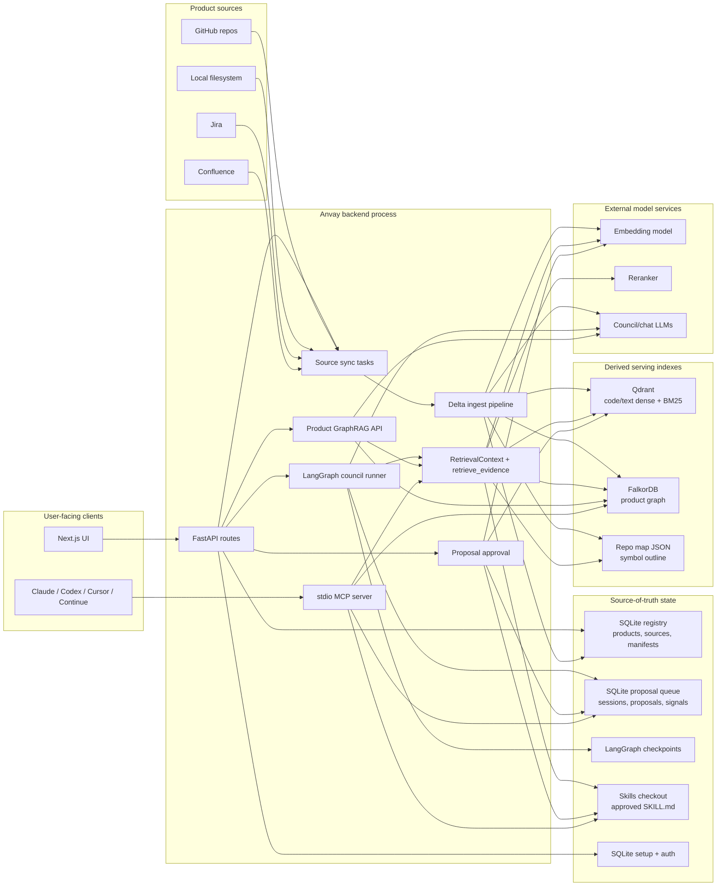

<p align="center">
  
</p>

<h1 align="center">Anvay</h1>

<p align="center">
  <strong>The always-current context brain for your project — served to any AI coding agent over MCP.</strong>
</p>

<p align="center">
  Anvay turns your repos and docs into reviewed, cited, eval-backed project
  intelligence, then serves it to Claude, Codex, Cursor, Continue, and any other
  MCP-capable client. One source of truth for how your project should be
  understood, maintained, and changed.
</p>

<p align="center">
  <a href="#quick-start">Quick Start</a>
  ·
  <a href="#how-it-works">How It Works</a>
  ·
  <a href="#use-it-with-your-agent">MCP Usage</a>
  ·
  <a href="#under-the-hood">Architecture</a>
  ·
  <a href="#repositories">Repositories</a>
</p>

<p align="center">
  <a href="./LICENSE"></a>
  
  
  
  
</p>

---

## Your project knows more than any single person does

That knowledge is scattered — across code, docs, issues, and the heads of a few
maintainers. New contributors don't know where to start. AI agents jump into
code without understanding conventions, architecture, or blast radius.
Maintainers answer the same questions, over and over, forever.

**Anvay fixes this by building a living context brain for your project.** Point
it at your repositories and docs, and it produces a product-scoped intelligence
layer — a retrieval index, a symbol-level repo map, a dependency graph, and a
human-approved playbook — that any AI coding agent can consume directly over the
Model Context Protocol (MCP).

It stays current as your project changes, it cites its sources, and every answer
it serves is backed by a continuous evaluation harness. No more agents guessing.
No more re-explaining your architecture in every chat.

## What you get

| | |
|---|---|
| 🧠 **Always-current context** | Delta-safe sync keeps the index in step with your repos. Change a file, and only that file is re-embedded — the brain never goes stale or rebuilds from scratch. |
| 🔌 **MCP-native by design** | Approved skills and cited project context are served over a standard MCP server. Works out of the box with Claude, Codex, Cursor, Continue, and any MCP client. |
| 🔎 **Hybrid RAG, not just vectors** | Retrieval blends dense + BM25 search, exact grep, a tree-sitter repo map, graph-local traversal, and approved-skill memory — mixed and reranked into one coverage-aware evidence set. |
| ✅ **Eval-backed quality** | Every retrieval change is gated by an evaluation harness measuring both deterministic retrieval metrics and LLM-judged answer quality. Quality is a number, not a vibe. |
| 👤 **Human-approved, agent-drafted** | A bounded expert council drafts a project playbook; a maintainer reviews and approves it before anything is published. Agents propose, humans decide. |
| 🌍 **Open source & sovereign** | Self-hostable, your data, your models. Run it against public OSS repos or your private engineering products without handing IP to a third party. |

## Built for maintainers

Anvay is an OSS-first tool that gives every contributor and coding agent a
maintainer's map of the project. Ask it the questions you're tired of answering:

- Where should a new contributor start?
- Which files, conventions, and tests matter for this change?
- What does this module depend on, and what breaks if it changes?
- What project-specific rules should every AI coding agent follow?
- Which tribal knowledge should become a reusable, cited playbook?

Anvay calls each isolated knowledge boundary a **product**. For OSS users, a
product is usually one project or a tightly related set of repos. The same engine
scales to internal engineering products without changing the core model.

## How It Works

Three steps, one source of truth.

```
  1. CONNECT                2. CURATE                 3. SERVE
  ─────────────             ─────────────             ─────────────
  Point Anvay at your       A bounded expert          Approved skills + cited
  GitHub repos, docs,       council drafts a          context stream to any
  filesystem, Jira, or      project playbook from     MCP agent. The brain
  Confluence. It builds     the evidence. You         stays current as your
  a delta-synced index,     review, edit, and         project changes.
  repo map, and graph.      approve it as a SKILL.md.
```

1. **Connect your sources.** Anvay ingests code and docs, chunks them on semantic
   boundaries (tree-sitter for code, headings for docs), embeds them dense +
   BM25, extracts a dependency graph, and persists a symbol-level repo map. Every
   resync is delta-safe — unchanged resources are skipped, changed ones are
   re-embedded before stale chunks are cleaned up.

2. **Curate a playbook.** On demand, a LangGraph expert council (planner →
   architect / domain / quality experts → synthesizer → repair → eval) drafts a
   single `product_master` Agent Skill, grounded in retrieved evidence with
   file:line citations. Incomplete or unfaithful drafts never reach you — they're
   caught by deterministic checks plus an LLM faithfulness gate.

3. **Serve it to agents.** You approve the proposal; Anvay writes a `SKILL.md` to
   your skills repo, indexes it so it's itself retrievable, and exposes it over
   MCP. From that moment, any connected coding agent loads your project's rules
   and cited context before it touches code.

## What Anvay Guarantees

- **Product-scoped tenancy.** Every source, chunk, proposal, session, skill, and
  query carries `product_id`. There is no cross-product read path.
- **Human approval before publication.** Agents draft proposals; only an explicit
  human approval writes a `SKILL.md`.
- **Delta-safe sync.** Resync reads SQLite manifests, skips unchanged resources,
  embeds changed resources *before* stale-chunk cleanup, and retires removed
  resources from the derived indexes. Failed steps never poison the index.
- **Eval-gated retrieval.** The serving path (`retrieve_evidence()`) is a
  multi-channel evidence engine — dense + BM25, exact grep, repo-map symbols,
  graph-local traversal, structural summaries, and approved skills — mixed and
  cross-encoder reranked. It is gated by an eval harness covering deterministic
  retrieval metrics (recall@k, ndcg@k, mrr) and LLM-judged answer quality
  (answer_correctness, context_recall). See [evals/README.md](./evals/README.md).
- **Portable output.** Approved skills are ordinary Agent Skills directories
  served through MCP, so every MCP-capable client consumes the same guidance.

## Quick Start

**Prerequisites:** Python 3.13+, [`uv`](https://docs.astral.sh/uv/), Docker (or a
reachable Qdrant), a DeepInfra API key for default cloud embeddings/reranking and
council LLMs, and the [UI repo](#repositories) cloned alongside this one at
`../anvay-ui/`.

```bash
# 1. Install backend deps
uv sync

# 2. Create local config
cp anvay.yaml.example anvay.yaml
cp .env.example .env

# 3. Fill required .env values
#    LLM_API_KEY=...                    # DeepInfra (or any OpenAI-compatible) key
#    ANVAY_TOKEN_KEY=...                # generate below
#    ANVAY_SKILLS_REPO_TOKEN=...        # PAT for the org skills repo
uv run python -c "from anvay.auth.token_cipher import TokenCipher; print(TokenCipher.generate_key())"

# 4. Start the backend stack (Qdrant + API)
make dev

# 5. Start the UI (in the sibling repo)
cd ../anvay-ui && npm install && npm run dev
```

Open `http://localhost:3000/setup`, connect or create your org skills repo, then
create a product, add a GitHub source with a service-account PAT, sync it, run the
council, and approve your first playbook.

> Default config uses cloud Qwen3 embeddings/reranking, so low-resource machines
> need no local model servers. For fully offline/self-hosted inference, use the
> `jina-local` profile with `make local-models-up` (llama.cpp). See
> [CONTRIBUTING.md](./CONTRIBUTING.md) for the local-dev deep dive.

## Use It With Your Agent

Add Anvay as an MCP server. Claude Desktop example:

```json
{
  "mcpServers": {
    "anvay": {
      "command": "uv",
      "args": [
        "--directory", "/absolute/path/to/anvay",
        "run", "anvay-mcp-server",
        "--product", "<your-product-id>"
      ],
      "env": { "ANVAY_CONFIG": "/absolute/path/to/anvay/anvay.yaml" }
    }
  }
}
```

Exposed MCP tools:

| Tool                   | Purpose                                                          |
| ---------------------- | ---------------------------------------------------------------- |
| `find_skills`          | Find approved product skills for a task or context.              |
| `get_skill`            | Return one approved skill body.                                  |
| `query_code_context`   | Retrieve product-scoped source context for a symbol or question. |
| `hybrid_search_corpus` | Run direct dense + BM25 + rerank corpus search.                  |
| `report_outcome`       | Record whether a skill helped.                                   |

## Repositories

Anvay ships as two repos that run side by side:

| Repo | Role | Link |
|---|---|---|
| **anvay** (this repo) | Python backend — ingestion, hybrid RAG, expert council, MCP server, API. | [github.com/0xaeres/nexus-core](https://github.com/0xaeres/nexus-core) |
| **anvay-ui** | Next.js web app — onboarding, sync logs, live council sessions, review/approval UX. | [github.com/0xaeres/nexus-ui](https://github.com/0xaeres/nexus-ui) |

Clone them as siblings so the backend's default `../anvay-ui/` paths resolve:

```bash
git clone git@github.com:0xaeres/nexus-core.git anvay
git clone git@github.com:0xaeres/nexus-ui.git anvay-ui
```

## Under the Hood

Anvay separates source-of-truth state (SQLite registry, proposal queue, skills
checkout) from derived serving state (Qdrant, FalkorDB graph, repo map JSON), so
the index can always be rebuilt from the manifests without losing approvals.



| Layer     | Component                           | Responsibility                                                                                                                                           |
| --------- | ----------------------------------- | -------------------------------------------------------------------------------------------------------------------------------------------------------- |
| API       | `anvay/api/`                        | Product, source, council, proposal, skill, setup, auth, and dashboard routes.                                                                            |
| Registry  | SQLite via `anvay/registry.py`      | Products, membership, runtime sources, sync manifests, sync runs, enrichment jobs.                                                                       |
| Queue     | SQLite via `anvay/council/queue.py` | Council sessions, proposal rows, eval results, improvement signals.                                                                                      |
| Ingest    | `anvay/ingest/`                     | Source diff, chunking, optional enrichment, embeddings, sparse vectors, graph extraction, derived-index writes, stale cleanup.                           |
| Retrieval | `anvay/retrieval/`                  | Dense + BM25 search, RRF, rerank, plus evidence assembly from grep, repo-map symbols, graph-local candidates, summaries, and approved skills.            |
| Council   | `anvay/council/`                    | Planner, expert fanout, synthesizer, repair, eval, finalizer, LangGraph checkpoints, SSE progress.                                                       |
| Skills    | `anvay/skills/`                     | Agent Skills parsing, storage, provenance, approval write path, Git commit/push, approved-skill indexing.                                                |
| MCP       | `anvay/mcp_server/`                 | `find_skills`, `get_skill`, `query_code_context`, `hybrid_search_corpus`, and the evidence/graph corpus tools.                                           |
| UI        | [`anvay-ui`](https://github.com/0xaeres/nexus-ui) | Product onboarding, sync logs, council sessions, review/approval UX.                                                          |

For the full runtime sequence, the product-skill lifecycle, API contracts, and
data models, see [ENGINEERING.md](./ENGINEERING.md). For a code-level module map
and end-to-end traces, see [CONTRIBUTING.md](./CONTRIBUTING.md).

## Development

```bash
uv run ruff check anvay tests evals     # lint — must be clean
uv run pytest -q                        # unit + integration tests
```

Eval and live checks are opt-in:

```bash
uv run anvay eval run --products <pid>              # unified quality harness (the gate)
uv run anvay eval run --products <pid> --force-ingest   # clean re-ingest, then evaluate
uv run pytest -m eval                               # retrieval benchmark (skips if infra absent)
make test-live-e2e                                  # live Qdrant end-to-end
```

The unified eval harness (`anvay eval run`) is the definitive quality gate. It
evaluates the full production retrieval path over per-product golden datasets and
gates on both deterministic retrieval metrics and LLM-judged answer quality. Run
it after any change to chunking, embedding, enrichment, hybrid search, reranking,
graph extraction, or evidence assembly. Thresholds and calibration live in
`evals/harness.py::Thresholds`; see [evals/README.md](./evals/README.md).

## Production Deployment

- **Backend:** Oracle VM, Docker Compose, Caddy TLS, FastAPI, private Qdrant.
- **Frontend:** Vercel running [`anvay-ui`](https://github.com/0xaeres/nexus-ui).
- **Auth:** Password/session bootstrap and session-based API auth.
- **Observability:** Langfuse when configured.

The full runbook — environment variables, smoke tests, backup targets, and
upgrade steps — is in [docs/DEPLOYMENT.md](./docs/DEPLOYMENT.md).

## Documentation Map

| File                                           | Use it for                                                    |
| ---------------------------------------------- | ------------------------------------------------------------- |
| [AGENTS.md](./AGENTS.md)                       | Non-negotiable invariants, conventions, commit checks.        |
| [CONTRIBUTING.md](./CONTRIBUTING.md)           | Contributor onboarding, code map, end-to-end traces, recipes. |
| [ENGINEERING.md](./ENGINEERING.md)             | Formal architecture, data model, API and pipeline contracts.  |
| [evals/README.md](./evals/README.md)           | Eval harness, golden datasets, quality gates.                 |
| [docs/DEPLOYMENT.md](./docs/DEPLOYMENT.md)     | Production deployment and operations.                         |
| [../anvay-ui/DESIGN.md](../anvay-ui/DESIGN.md) | Frontend design system and IA rules.                          |

## License

Apache License 2.0. See [LICENSE](./LICENSE).
